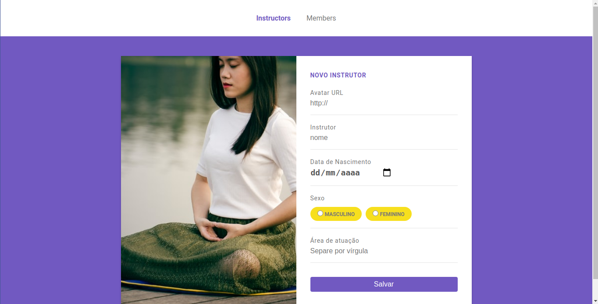
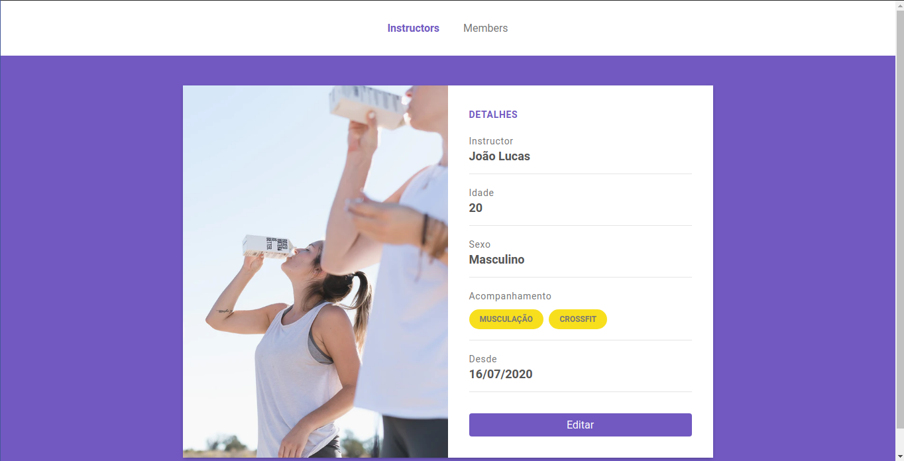
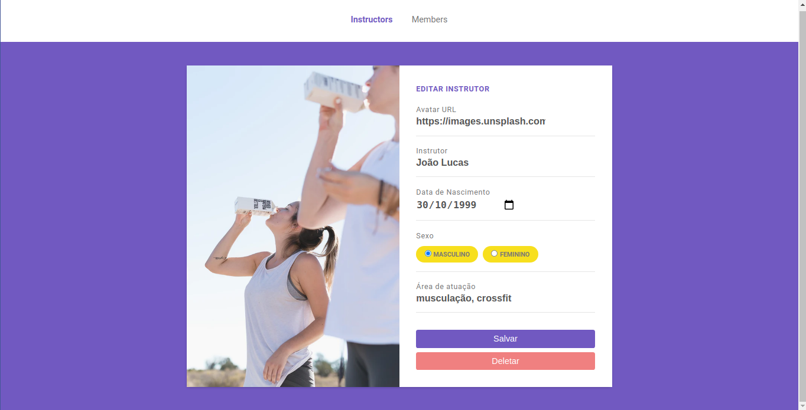
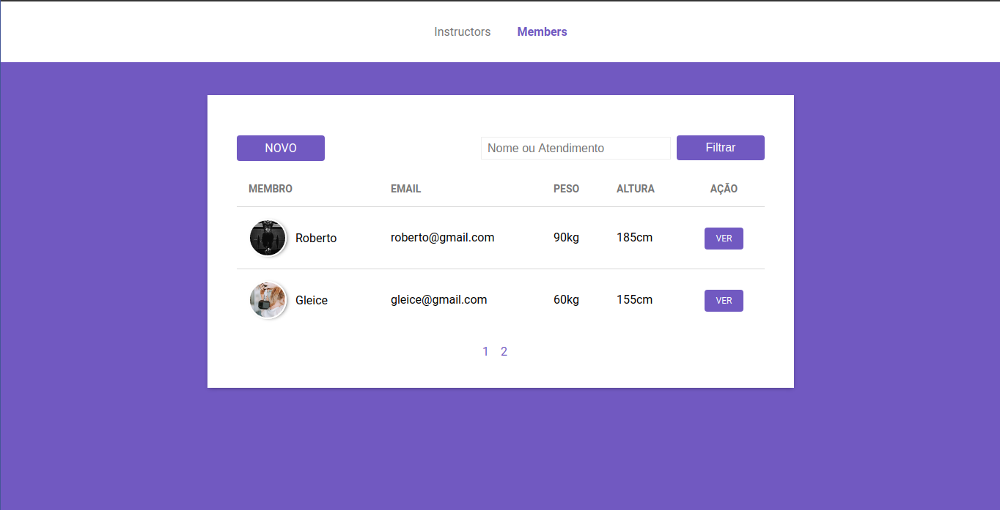
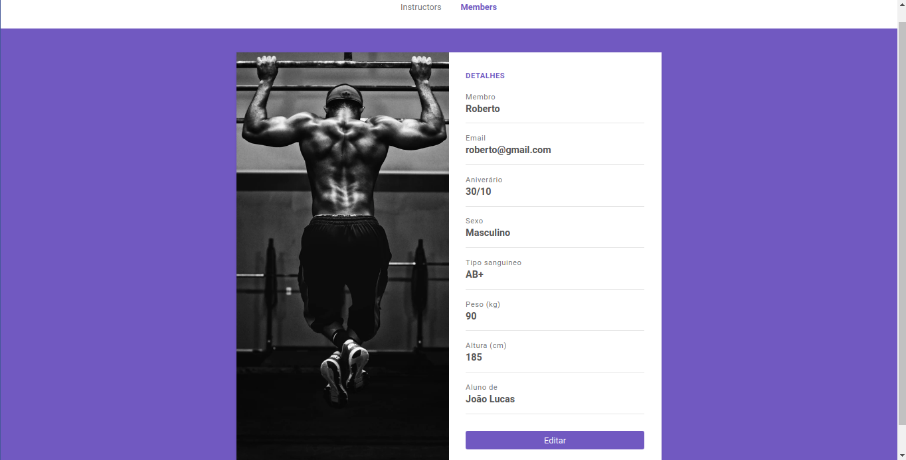
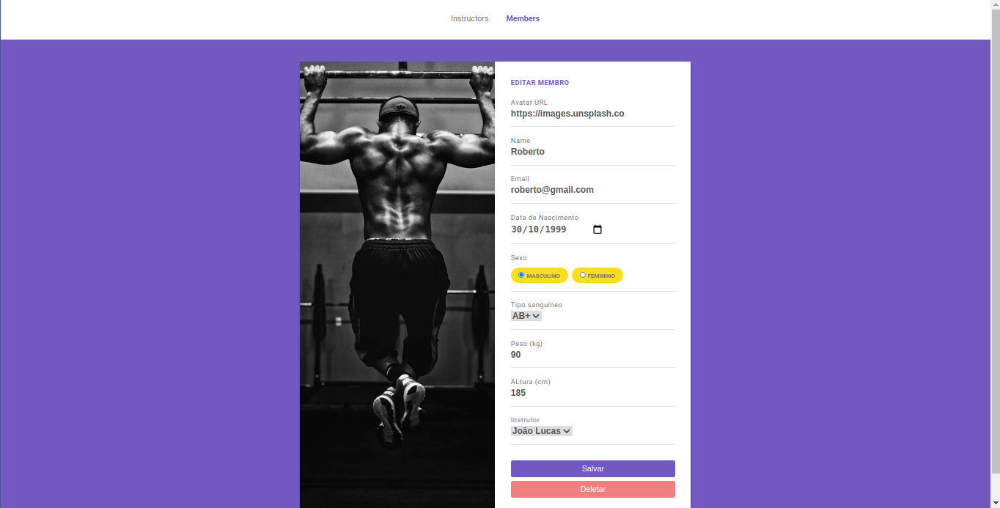

<h1 align="center">
    Gym Control
</h1>
 
<h4 align="center"> 
	🏋‍♂ Gym Control 🏋‍♀
</h4>

<p align="center">
  

  

  	
  <a href="https://www.linkedin.com/in/paulobeckman/">
    
  </a>
	
  
  <a href="https://github.com/paulobeckman/Gym-control/commits/master">
    
  </a>

  
   <a href="https://github.com/paulobeckman/Gym-control/stargazers">
    
  </a>
</p>


## 💻 Sobre o projeto

🏋‍♂Gym Control - é um sistema de cadastro de Instrutores e Membros, afim de ter um melhor controle sobre os instrutores e membros de sua academia.

Os Instrutores poderão se cadastrar na plataforma web enviando:
- url de uma imagem 
- seu nome
- data de nascimento
- sexo
- área de atuação

Os Membros poderão se cadastrar na plataforma web enviando:
- url de uma imagem 
- seu nome
- email
- data de nascimento
- sexo
- tipo sanguíneo
- peso
- altura

Além de fazer cadastro o sistema permite visualizar os dados, fazer edição e deletar. 

O sistema armazena todas as informações no banco de dados postgres.

Também o sistema conta com um sistema de filtro por nome ou atendimento no caso dos instrutor. E nome ou email no caso do membro. Além do sistema de filtro o sistema conta com paginação exibindo 2 perfis de usuário por pagina, seja instrutor, seja membro.


Projeto desenvolvido no curso **LaunchBase** oferecida pela [Rocketseat](rs).
"O [LaunchBase](lb) é um treinamento no formato de bootcamp online que tem duração de 8 semanas. A cada semana os conteúdos são liberados de acordo com um cronograma, guiando o aluno pelas ferramentas e conceitos mais modernos de desenvolvimento que permitirão construir as melhores aplicações e ter acesso às melhores oportunidades como programador." - Rocketseat


### Web

<p align="center" style="display: flex; align-items: flex-start; justify-content: center;">
	
 

  

  
  
  
  
  

  

  

  

  
  
</p>

## 🛠 Tecnologias

As seguintes ferramentas foram usadas na construção do projeto:

- [Node.js][nodejs]
- [Java Script][js]
- [CSS][CSS]
- [HTML][HTML]
- [Nunjucks][Nunjucks]
- [Unsplash Source][API]
- [Postgres][pg]


## 🚀 Como rodar este projeto
 
Podemos considerar este projeto como sendo divido em duas partes:
1. Back End (arquivos server.js, routes.js, script.js e pastas controllers, models, config e lib) 
2. Front End (pasta views e arquivo styles.css)

💡Tanto o Front End quando o Back End irão rodar assim que a aplicação for iniciada.

### Pré-requisitos

Antes de começar, você vai precisar ter instalado em sua máquina as seguintes ferramentas:
[Git](https://git-scm.com), [Node.js][nodejs]. 
Além disto é bom ter um editor para trabalhar com o código como [VSCode][vscode]

### 🧭 Rodando a aplicação web (Front End e Back End)

```bash
# Clone este repositório
$ git clone https://github.com/paulobeckman/Gym-control.git

# Acesse a pasta do projeto no terminal/cmd
$ cd Gym-control

# Instale as dependências
$ npm install

# Execute a aplicação em modo de desenvolvimento
$ npm start

# O servidor inciará na porta:3000 - acesse http://localhost:3000
```


## 📝 Licença

Este projeto esta sobe a licença MIT. Veja a [LICENÇA](license) para saber mais.

Feito por Paulo Beckman 👋🏽 [Entre em contato!](https://www.linkedin.com/in/paulobeckman/)

[nodejs]: https://nodejs.org/
[vscode]: https://code.visualstudio.com/
[license]: https://opensource.org/licenses/MIT
[rs]: https://rocketseat.com.br
[lb]: https://pages.rocketseat.com.br/launchbase/inscricao/5
[js]: https://developer.mozilla.org/pt-BR/docs/Aprender/JavaScript
[CSS]: https://developer.mozilla.org/pt-BR/docs/Web/CSS
[HTML]: https://developer.mozilla.org/pt-BR/docs/Web/HTML
[Nunjucks]: https://www.npmjs.com/package/nunjucks
[API]: https://source.unsplash.com/
[pg]: https://www.postgresql.org/
